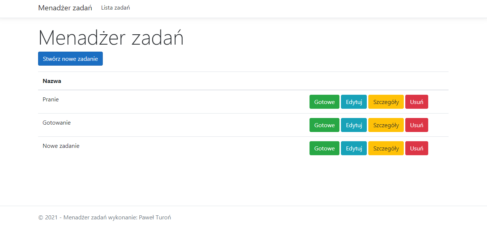

# TaskManager

Prosta aplikacja do sporządzania listy zadań w ASP.NET Core MVC stworzona w oparciu o tutorial: https://www.youtube.com/watch?v=xcDEYIUFmU4

Aplikacja pozwala na dodawanie zadań, podgląd szczegółów zadania, edycję zadania, usuwania zadania oraz oznaczania zadania jako gotowego. Wszystkie zadania zapisywane są w lokalnej bazie danych MSSQL Server Management Studio. Żeby móc zapisywać dane w bazie, konieczna będzie konfiguracja pod kątem nazwy bazy i tabeli.
Projekt powstał w ramach ćwiczeń.

Poniżej zrzut ekranu przedstawiający wygląd aplikacji po uruchomieniu.

